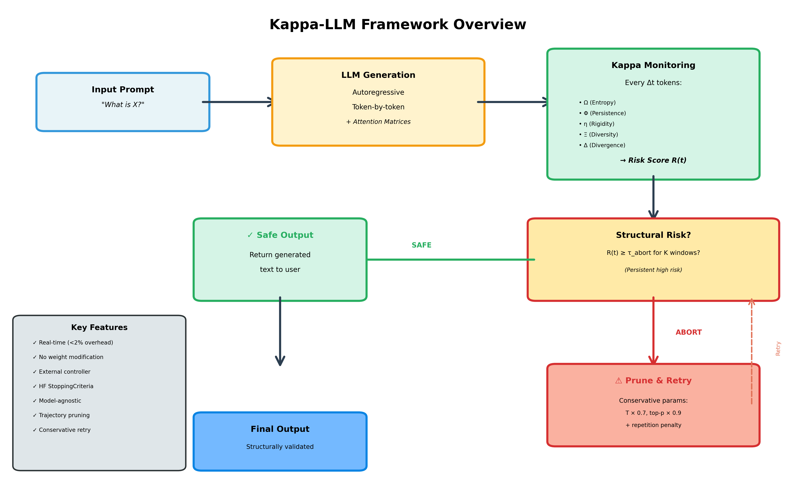

[](https://doi.org/10.5281/zenodo.18529821)
[](https://creativecommons.org/licenses/by/4.0/)
[](https://www.python.org/downloads/)
[](./papers/PAPER_KAPPA_LLM_EN.md)

# Kappa-LLM: Multi-Observable Structural Detection and Real-Time Mitigation of Hallucinations

*Kappa-Attention-Regimes — empirical application of the Kappa Method to LLM attention dynamics*


Official implementation of **"Kappa-LLM: Multi-Observable Structural Detection and Real-Time Mitigation of Hallucinations in Large Language Models"** using topology-aware observables

<p align="center">
  
</p>

---

## 🎯 **Overview**

Kappa-LLM is a multi-observable framework for detecting and mitigating hallucinations in Large Language Models (LLMs) during generation. Rather than post-hoc fact-checking, we monitor **structural attention dynamics** in real-time and prune unsafe trajectories before semantic failure.
This repository provides an empirical application of the **Kappa Method**
(see https://github.com/odavidohio/Kappa-Method) to attention dynamics in large language models.


### **Key Features**

✅ **Real-Time Detection**: Monitors attention dynamics during generation (<2% overhead)  
✅ **Multi-Observable Framework**: 5 canonical observables (Ω, Φ, η, Ξ, Δ) capture structural instability  
✅ **Cross-Architecture**: Validated on Phi-3, Mistral-7B, Llama-3.1-8B  
✅ **Production-Compatible**: Designed to integrate with HuggingFace `StoppingCriteria`
✅ **Strong Performance**: 94.2% AUC (Phi-3), 85% accuracy, +36.5pp over baseline  

---

## 📊 **Main Results**

| Model | Kappa AUC | Accuracy | R-Score AUC | Improvement |
|-------|-----------|----------|-------------|-------------|
| **Phi-3 Mini** | 94.2% | 85.0% | 57.7% | **+36.5pp** |
| **Mistral-7B** | 87.1% | 70.0% | 58.3% | **+28.8pp** |
| **Llama-3.1-8B** | 79.1% | 61.0% | 57.7% | **+21.4pp** |

**Computational Overhead:** <2% (10-15ms per checkpoint on A100)

> **Note:** Binary accuracy is bounded by architectural stability and is not the primary objective of the framework. The goal is structural risk detection, not semantic verification.

> ⚠️ API note: The real-time integration shown below reflects the intended
> interface for the first stable release. Current versions expose the detector
> as a scoring component over extracted attention windows.

---

## 🚀 **Quick Start**

### **Installation**

```bash
# Clone repository
git clone https://github.com/odavidohio/Kappa-Attention-Regimes.git
cd Kappa-Attention-Regimes

# Install dependencies
pip install -r requirements.txt

# Install package
pip install -e .
```

### **Basic Usage**

```python
from kappa_llm import KappaDetector
from transformers import AutoModelForCausalLM, AutoTokenizer

# Load model
model = AutoModelForCausalLM.from_pretrained("microsoft/Phi-3-mini-4k-instruct")
tokenizer = AutoTokenizer.from_pretrained("microsoft/Phi-3-mini-4k-instruct")

# Initialize Kappa detector
detector = KappaDetector(
    model=model,
    window_size=10,
    check_interval=5,
    tau_abort=0.74,  # Phi-3 calibrated threshold
    persistence_k=2
)

# Generate with real-time monitoring
prompt = "What is the capital of France?"
outputs = model.generate(
    tokenizer.encode(prompt, return_tensors="pt"),
    max_length=100,
    stopping_criteria=[detector]
)

# Check if generation was pruned
if detector.was_pruned:
    print(f"⚠️ Generation pruned at token {detector.prune_position}")
    print(f"📊 Structural risk: {detector.final_risk:.3f}")
else:
    print(f"✅ Generation completed safely")
    print(tokenizer.decode(outputs[0]))
```


## 📖 **Documentation**

### **Papers**

- 📄 [English Paper](./papers/PAPER_KAPPA_LLM_EN.md) - Full methodological description
- 📄 [Portuguese Paper](./papers/PAPER_KAPPA_LLM_PT.md) - Versão completa em português


## 🔗 **Related Work**

- **Kappa-Method** — Theoretical foundation of the Kappa framework, defining
  the canonical observables (Ω, Φ, η, Ξ, Δ) and regime analysis used in this work.  
  https://github.com/odavidohio/Kappa-Method

### **Examples**

- 💡 [Basic Usage](./examples/basic_usage.py)

---

## 🧪 **Reproducing Experiments**

### **HaluEval Dataset**

```bash
# Download HaluEval dataset
python experiments/download_halueval.py

# Run experiments (Phi-3)
python experiments/halueval/run_phi3.py \
    --model microsoft/Phi-3-mini-4k-instruct \
    --output ./experiments/results/phi3/

# Run experiments (Mistral)
python experiments/halueval/run_mistral.py \
    --model mistralai/Mistral-7B-Instruct-v0.2 \
    --output ./experiments/results/mistral/

# Run experiments (Llama)
python experiments/halueval/run_llama.py \
    --model meta-llama/Llama-3.1-8B-Instruct \
    --output ./experiments/results/llama/
```

### **Generate Figures**

```bash
# Generate all paper figures
python experiments/generate_figures.py \
    --results_dir ./experiments/results/ \
    --output_dir ./papers/figures/
```

---

## 🔬 **Method Overview**

### **The Five Observables**

Kappa-LLM computes five canonical observables from attention matrices:

| Observable | Symbol | Measures | AUC (Phi-3) |
|------------|--------|----------|-------------|
| **Entropy** | Ω | Attention mass distribution | 93.1% |
| **Persistence** | Φ | Topological structure (0-dim holes) | 58.0% |
| **Rigidity** | η | Semantic alignment stability | 93.1% |
| **Diversity** | Ξ | Head specialization | 69.3% |
| **Divergence** | Δ | Structural deviation from baseline | 93.1% |

### **Kappa Score**

```python
# Composite score combining all observables
K(t) = sigmoid(
    α_Ω · (1 - Ω(t)) +
    α_Φ · Φ(t) +
    α_η · η(t) +
    α_Ξ · (1 - Ξ(t)) +
    α_Δ · Δ(t)
)
```

### **Real-Time Pruning**

Uses **second-order statistics** (observable variability) for early detection:

```python
# Structural risk estimation
R(t) = sigmoid(
    α_η · σ_η(t) +  # Rigidity std
    α_ω · σ_ω(t) +  # Entropy std
    α_δ · σ_δ(t) +  # Divergence std
    β · dR̄/dt       # Acceleration term
)

# Abort if persistently high risk
if R(t) ≥ τ_abort for K consecutive windows:
    prune_generation()
```

---

## 📐 **Architecture-Specific Calibration**

Different models require different thresholds:

| Model | Δt (tokens) | τ_abort | K | AUC | Accuracy |
|-------|-------------|---------|---|-----|----------|
| **Phi-3** | 10 | 0.74 | 2 | 94.2% | 85% |
| **Mistral** | 12 | 0.71 | 2 | 87.1% | 70% |
| **Llama** | 12-15 | 0.68 | 3 | 79.1% | 61% |


---

## 🧬 **Empirical Signature of the Obsessive Attractor**

Hallucinations exhibit a characteristic observable pattern:

| Observable | Factual | Hallucination | Pattern |
|------------|---------|---------------|---------|
| Ω (Entropy) | 0.443 | 0.389 | ↓ Lower |
| η (Rigidity) | 0.557 | 0.611 | ↑ Higher |
| Ξ (Diversity) | 0.042 | 0.028 | ↓ Lower |
| Δ (Divergence) | 0.557 | 0.611 | ↑ Higher |

**Interpretation:** Hallucinations = premature collapse onto spurious attractors with **high confidence + low entropy**.

---

## ⚠️ **Limitations**

Kappa-LLM does not claim to eliminate hallucinations. The framework focuses on:

- **Structural Risk Detection**: Identifying high-risk attention trajectories, not semantic verification
- **Early Mitigation**: Interrupting unstable generation before semantic failure
- **Bounded Accuracy**: Structurally stable generations may still be factually incorrect

**Key Understanding:** This is a trajectory-level structural control system, not a fact-checking oracle. The natural upper bound on binary accuracy reflects architectural stability constraints, not framework failure.

**What We Do:** Detect when attention dynamics become structurally unstable  
**What We Don't Do:** Verify factual correctness or eliminate all hallucinations

---
## 📚 Citation

If you use this work, please cite:

```bibtex
@software{ohio2026kappa_llm,
  author       = {Ohio, David},
  title        = {Kappa-LLM: Multi-Observable Structural Detection and Real-Time Mitigation of Hallucinations in Large Language Models},
  year         = {2026},
  publisher    = {Zenodo},
  doi          = {10.5281/zenodo.18529821},
  url          = {https://doi.org/10.5281/zenodo.18529821}
}
```

---

## 🤝 **Contributing**

We welcome contributions! Please see [CONTRIBUTING.md](./CONTRIBUTING.md) for guidelines.

### **Areas for Contribution**

- 🔧 Additional model integrations (GPT-4, Claude, Gemini)
- 📊 Domain-specific benchmarks (medical, legal, financial)
- ⚡ Performance optimizations
- 📖 Documentation improvements
- 🧪 Additional observables (Γ - gradient flow)
  > Note: Gradient-based observables (Γ) are intentionally excluded from the current paper due to lack of empirical validation. Future work may explore optimization dynamics.

---

## 📜 **License**


**Code:** This repository, including code, documentation, and theoretical materials,
is licensed under the Creative Commons Attribution 4.0 International (CC BY 4.0) license.
See the LICENSE file for details.
🔗 https://creativecommons.org/licenses/by/4.0/

Attribution: If you use, adapt, or build upon the Kappa Method or its observables (Ω, Φ, η, Ξ, Δ), please provide appropriate credit to the original author and cite the associated materials.


---

## 🙏 **Acknowledgments**

- **HaluEval dataset:** Liu et al. (2023).  
  https://github.com/RUCAIBox/HaluEval

- **Kappa Method theoretical foundation:** Ohio, David (2026).  
  https://github.com/odavidohio/Kappa-Method

---

## 📧 **Contact**

**David Ohio**  
📧 Email: odavidohio@gmail.com  
🔗 GitHub: [@odavidohio](https://github.com/odavidohio)  

---

## 🔗 **Related Work**

- **Kappa-EDU**: Educational dropout prediction using Kappa Method
- **Kappa-FIN**: Financial crisis detection via attention topology

---

## ⭐ **Star History**

If you find this work useful, please consider starring the repository!

[](https://star-history.com/#odavidohio/Kappa-Attention-Regimes&Date)

---

## 📊 **Project Stats**


---

**Built with ❤️ for safe and reliable LLM deployment**

*Last updated: February 8, 2026*
